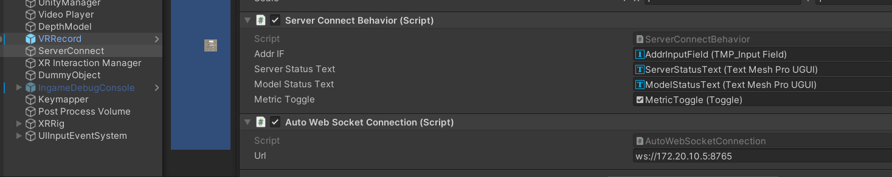

# DepthViewerMR


## Desktop vs Varjo Scenes


If you don't have a Varjo compatible headset (i.e., Varjo XR3) you can use the default scene thought for desktops. 
This scene can be found in the ```DepthViewerMR/DEPTH/Assets/MainWS_desktop```.

In case you want to live the experience with the Varjo device, please follow the related setting Section.

## Connection the the server

To visualize the pseudo 3D depth scene, you must change the websocket address in the ```Auto Web Socket Connection``` component in the Unity GameObject ```ServerConnect``` by putting the address showed by the frame capturing server.



## Set up Varjo Scene Rendering

From the Unity Editor, go into Edit > Project Settings.

1. Go into the ```XR Plug-in Management``` tab and select the Varjo checkbox;

2. Go into the ```Graphics``` tab and select the HDRP option under the Scriptable Rendere Pipeline Settings;

3. If enabled, please disable the ```Opaque``` checkbox from the  ```XR Plug-in Management > Varjo``` tab in order to visualize the MR mask.


## References 

* [Varjo XR Plugin for Unity](https://developer.varjo.com/docs/unity-xr-sdk/getting-started-with-varjo-xr-plugin-for-unity)